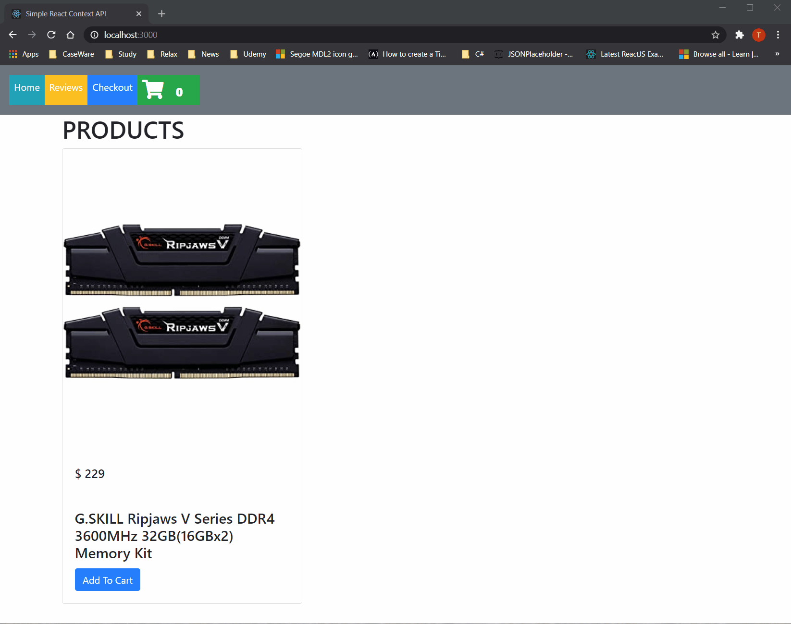

# Simple demonstation project for using React Hook Context API
- useContext
- useReducer
- createContext

# The APIs will eliminate the using of redux in data management

# Demo

[https://simple-react-context-api.web.app/]
